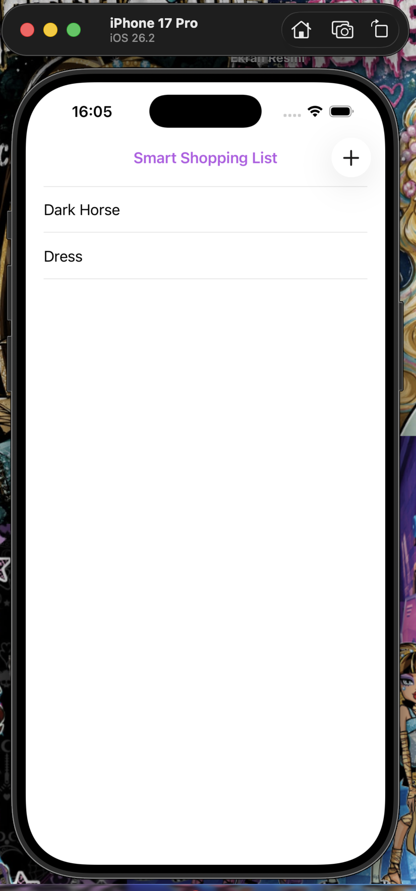
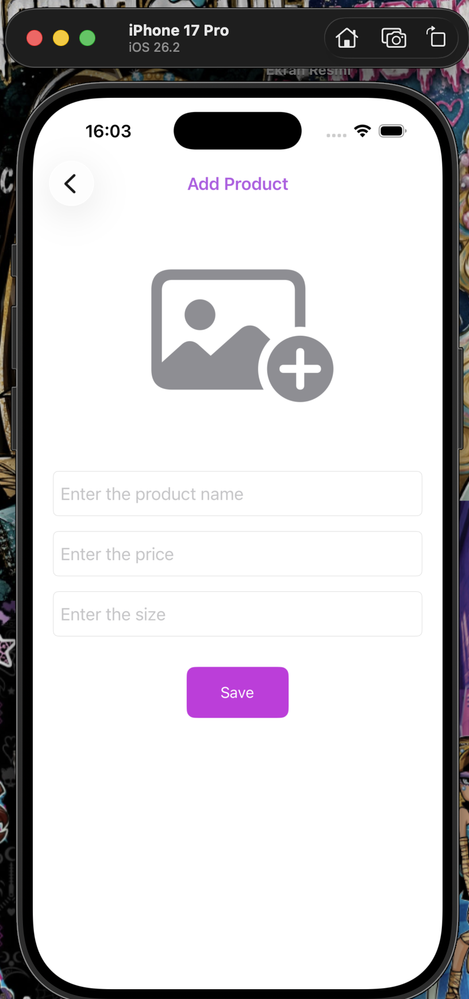
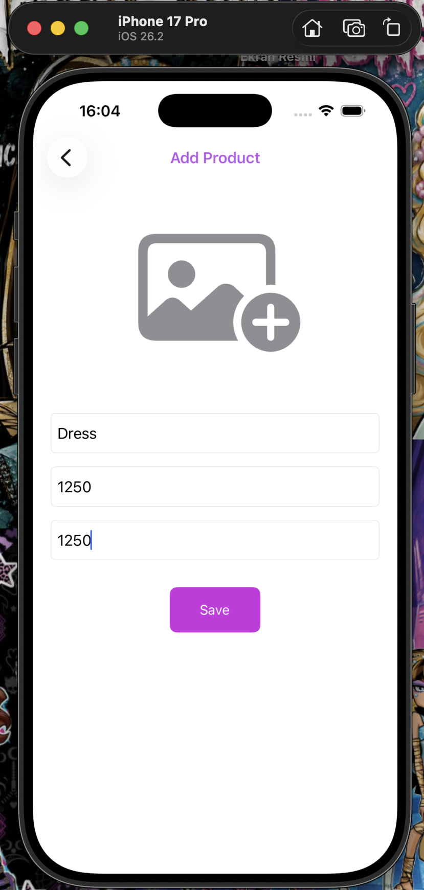
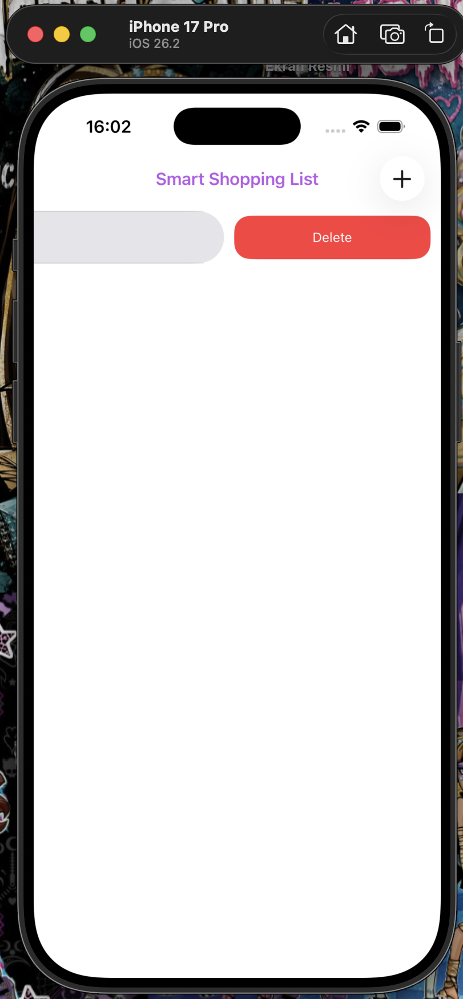
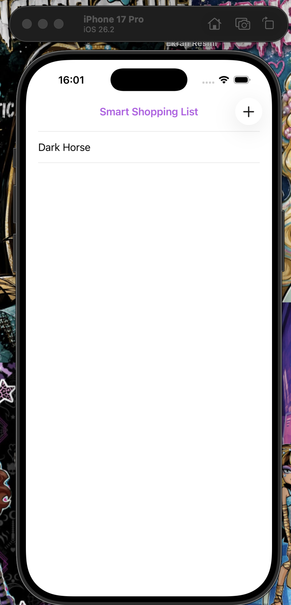

#  SmartShoppingList

A clean, programmatic iOS application designed for managing a personal shopping list. Built with **MVVM architecture**, it leverages **Core Data** for persistent storage, **SnapKit** for layout management, and modern **PhotosUI (PHPicker)** for image selection.

---

##  Screenshots

| Shopping List | Add Product | Save Details | Delete Item | Persistent Data |
|:-------------:|:-----------:|:------------:|:-----------:|:---------------:|
|  |  |  |  |  |

---

##  Features

* **MVVM Architecture & Delegate Pattern:** Decoupled business and data logic using view models and delegate callbacks (`DetailsViewModelDelegate`) to refresh lists upon saving.
* **Core Data Persistence:** Full CRUD functionality (create, read, delete) using Apple's Core Data framework to persist product details locally.
* **Modern Photo Picker:** Utilizes `PHPickerViewController` for secure and smooth image selection from the photo library.
* **Programmatic UI with SnapKit:** Storyboard-free UI structure built with SnapKit Auto Layout.
* **Smart Keyboard Handling:** Integrated `IQKeyboardManagerSwift` for automatic layout adjustments during text input.

---

##  Tech Stack & Libraries

* **Language:** Swift
* **UI Framework:** UIKit (Programmatic UI)
* **Architecture:** MVVM
* **Data Persistence:** Core Data
* **Media Handling:** PhotosUI (PHPickerViewController)
* **Layout Engine:** SnapKit
* **Third-Party Libraries:** IQKeyboardManagerSwift

---

##  Installation & Setup

1. **Clone the repository:**
   ```bash
   git clone [https://github.com/MelikeS28/SmartShoppingList.git](https://github.com/MelikeS28/SmartShoppingList.git)
